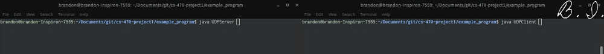

# Sample UDP Client-Server Program
This program illustrates how to use `DatagramSocket` and `DatagramPacket` to send and receive over UDP in Java. The server will serve one client before closing.

## Usage
Both the client and server are meant to be run on the same machine for illustration purposes.  
**NOTE:** The order is important here, as the client can't connect to a server that doesn't exist!

1. Compile both the client and server
```bash
javac UDPClient.java
javac UDPServer.java
```
2. Start the server in one terminal window
```bash
java UDPServer
```

3. In another terminal window, start the client
```bash
java UDPClient
```

## Expected Behavior
**NOTE:** The port number of the client is dynamic, but the port number of the server is hard-coded.  
