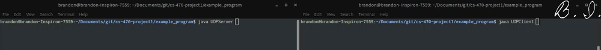

# Sample UDP Client-Server Program
This program illustrates how to use `DatagramSocket` and `DatagramPacket` to send and receive over UDP in Java. The server will serve one client before closing.

## Usage
Both the client and server are meant to be run on the same machine for illustration purposes.  
**NOTE:** The order is important here, as the client can't connect to a server that doesn't exist!

### Using `make`
1. Compile and run the server
```bash
make exampleServer
```

2. Compile and run the client in another terminal window
```bash
make exampleClient
```

### Using `javac` and `java`
1. Compile both the client and server from the main repo root
```bash
javac exampleprogram/UDPClient.java
javac exampleprogram/UDPServer.java
```
2. Start the server in one terminal window from the main repo root
```bash
java exampleprogram.UDPServer
```

3. In another terminal window, start the client from the main repo root
```bash
java exampleprogram.UDPClient
```

## Expected Behavior
**NOTE:** The port number of the client is dynamic, but the port number of the server is hard-coded.  
